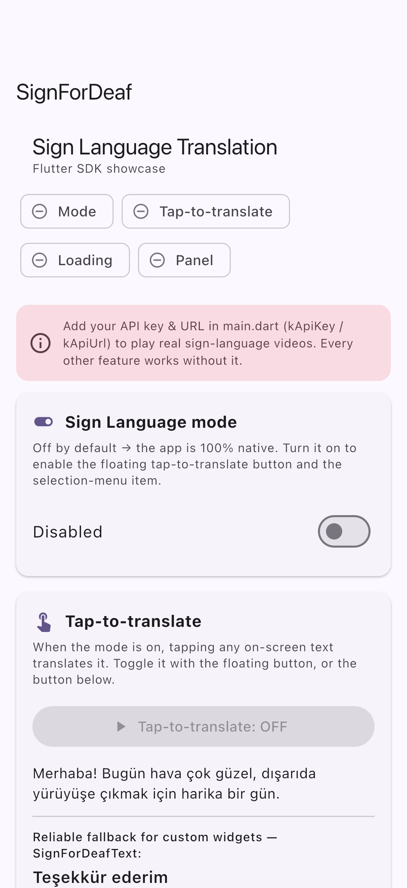
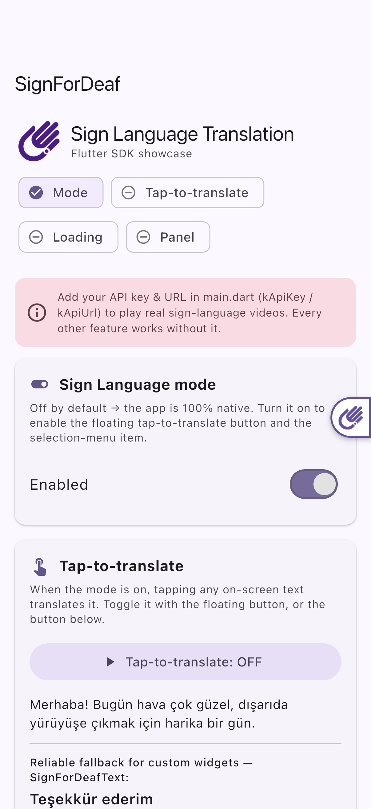
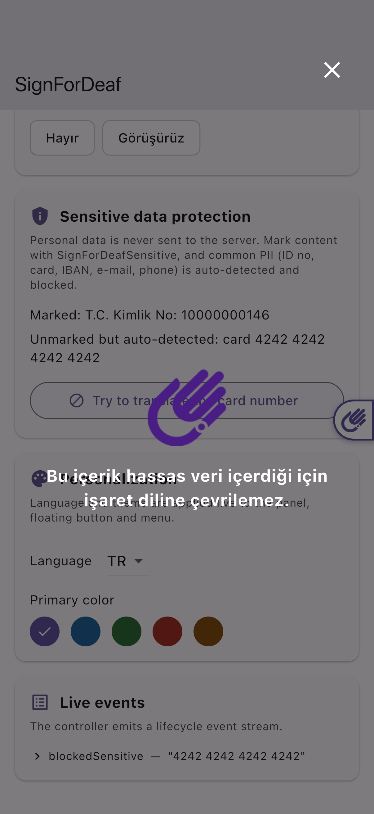

<!--
This README describes the package. If you publish this package to pub.dev,
this README's contents appear on the landing page for your package.

For information about how to write a good package README, see the guide for
[writing package pages](https://dart.dev/tools/pub/writing-package-pages).

For general information about developing packages, see the Dart guide for
[creating packages](https://dart.dev/guides/libraries/create-packages)
and the Flutter guide for
[developing packages and plugins](https://flutter.dev/to/develop-packages).
-->

# SignForDeaf Mobile Sign Language

## 🚀 Setup (recommended): `SignForDeafInit`

Wrap your app **once** at the very top — the same ergonomics as `ScreenUtilInit`.
The SDK is then active on every screen (floating button, tap-to-translate,
selection menu, `SignForDeaf.of(context)`), for **any router**.

```dart
void main() => runApp(
  SignForDeafInit(
    config: const SignForDeafConfig(
      apiKey: 'YOUR_API_KEY',   // rk parameter
      apiUrl: 'YOUR_API_URL',   // API base URL, e.g. https://kor01rp02.signfordeaf.com
      // originUrl: 'https://yourapp.example',  // optional — Origin header + `url`
      //                                        // param; defaults to apiUrl
      // language: SignLanguage.turkish,        // tr | en | ar  (de/fr/es coming soon)
      // fdid: '16', tid: '23',
      // theme: SignForDeafTheme(primaryColor: Color(0xFF6750A4)),
      // floatingButton: FloatingButtonConfig(hintMaxShows: 2),
      // accessibility: SignForDeafAccessibility(announceOnOpen: true),
    ),
    autoEnable: false, // turn on from a settings switch, or true by profile
    builder: (context, child) => MaterialApp(
      home: const HomePage(),
    ),
  ),
);
```

**Config fields** (`SignForDeafConfig`):

| Field            | Required | Default      | Description                                                                                                                                          |
| ---------------- | -------- | ------------ | ---------------------------------------------------------------------------------------------------------------------------------------------------- |
| `apiKey`         | ✅       | —            | Your SignForDeaf API key (`rk`).                                                                                                                     |
| `apiUrl`         | ✅       | —            | API base URL.                                                                                                                                        |
| `originUrl`      | —        | `apiUrl`     | Origin identifying your app/site — sent as the `Origin` header and the `url` query param. Override only if your integration needs a distinct origin. |
| `language`       | —        | `turkish`    | `tr / en / ar` (de/fr/es not yet supported).                                                                                                         |
| `fdid` / `tid`   | —        | `16` / `23`  | Dictionary / translator identifiers.                                                                                                                 |
| `theme`          | —        | brand purple | `primaryColor`, `textColor`.                                                                                                                         |
| `floatingButton` | —        | enabled      | Floating button appearance/behavior.                                                                                                                 |
| `accessibility`  | —        | —            | Screen-reader announcements & labels.                                                                                                                |
| `autoEnable`     | —        | `false`      | Enable the SDK on start.                                                                                                                             |

It sits **above** `MaterialApp`, so it is router-agnostic — it never touches the
router's builder, observers or routes. Works identically with `MaterialApp`,
`MaterialApp.router`, **go_router**, **auto_route** and nested navigators:

```dart
SignForDeafInit(
  config: const SignForDeafConfig(apiKey: '...', apiUrl: '...'),
  builder: (context, child) => MaterialApp.router(
    routerConfig: appRouter, // go_router / auto_route
  ),
);
```

It can be freely nested with `ScreenUtilInit` (either order):

```dart
SignForDeafInit(
  config: const SignForDeafConfig(apiKey: '...', apiUrl: '...'),
  builder: (context, child) => ScreenUtilInit(
    designSize: const Size(402, 874),
    builder: (context, child) => MaterialApp.router(routerConfig: appRouter),
  ),
);
```

> The classic pattern below (placing `SignForDeaf` inside `MaterialApp.builder`)
> also works and stays supported.

## 🧑🏻💻 Usage

### 📄main.dart

Wrap your MaterialApp with the SignForDeaf widget and enter the required information

```dart
class MyApp extends StatelessWidget {
  const MyApp({super.key});

  @override
  Widget build(BuildContext context) {
    return SignForDeaf(
      requestKey: 'YOUR_API_KEY',
      requestUrl: 'YOUR_API_URL',
      child: MaterialApp(
        title: 'Flutter App',
        theme: ThemeData(
          colorScheme: ColorScheme.fromSeed(seedColor: Colors.deepPurple),
          useMaterial3: true,
        ),
        ...
      ),
    );
  }
}
```


## ⚠️Warning

If you use multiple other pages or alternative router structures in your application, ensure the
widget's build on every page by rebuilding the structure!

### Example-1 (MaterialApp.builder)

```dart
class MyApp extends StatelessWidget {
 const MyApp({super.key});

 @override
 Widget build(BuildContext context) {
   return MaterialApp(
     title: 'Flutter Demo',
     builder: (context, child) {
       return SignForDeaf(
         requestKey: 'YOUR_API_KEY',
         requestUrl: 'YOUR_API_URL',
         child: child!,
       );
     },
     theme: ThemeData(
       colorScheme: ColorScheme.fromSeed(seedColor: Colors.deepPurple),
       useMaterial3: true,
     ),
     ...
   );
 }
}
```

## 🆕 Config, On/Off, Floating Button & Tap-to-Translate (v1.1.0)

A single-object config, an on/off switch, a floating tap-to-translate button and
opt-in selection-menu integration.

> **Behavior change:** the package no longer forces all text to be selectable
> (the old always-on long-press menu hurt normal UX). When the SDK is **off**
> (the default) your app behaves 100% natively. Turn it on to enable the
> floating **tap-to-translate** button and the sign-language selection-menu item.

### On/off (settings switch or auto by profile)

The SDK is **disabled by default**. Enable it from a settings toggle, or
automatically:

```dart
// From anywhere below the widget:
SignForDeaf.of(context).enable();   // e.g. bound to a Switch
SignForDeaf.of(context).disable();

// Or auto-enable (e.g. based on the user's accessibility profile):
SignForDeaf(config: SignForDeafConfig(apiKey: '…', apiUrl: '…', autoEnable: true), child: …)
```

### Sign-language item in the native selection menu (opt-in)

The package does **not** make your text selectable. Where your app already has
selectable text, add our builder so the menu shows **İşaret Dili** while the SDK
is enabled:

```dart
Builder(builder: (context) {
  final sfd = SignForDeaf.of(context);
  return SelectableText('Merhaba dünya', contextMenuBuilder: sfd.contextMenuBuilder);
  // Works for TextField too.
});
```

### Single-object config + shared controller

```dart
final controller = SignForDeafController(
  storage: SharedPreferencesSignForDeafStorage(), // optional persistence
);

MaterialApp(
  builder: (context, child) => SignForDeaf(
    controller: controller,
    config: const SignForDeafConfig(
      apiKey: 'YOUR_API_KEY',
      apiUrl: 'YOUR_API_URL',
      language: SignLanguage.turkish,            // tr/en/ar
      theme: SignForDeafTheme(primaryColor: Color(0xFF6750A4)),
      floatingButton: FloatingButtonConfig(hintMaxShows: 2),
    ),
    onEvent: (e) => debugPrint('event: ${e.type}'),
    child: child!,
  ),
  home: const HomeScreen(),
);
```

Read state / call actions anywhere below the widget:

```dart
final c = SignForDeaf.of(context); // SignForDeafController
c.enable();
c.toggleTapToTranslate();
c.translate('Merhaba');            // programmatic translation
```

### Tap-to-translate

When the floating button turns the mode on, tapping any on-screen text
translates it. Capture works by hit-testing the render tree for the paragraph
under the finger. For custom-painted or transformed text where that is
unreliable, wrap it with `SignForDeafText('...')` as a guaranteed-tappable
fallback.

> Note: Flutter renders the whole UI to a single native surface, so React
> Native's native per-`TextView` tap listeners don't apply here — the Dart
> hit-test is the Flutter-native equivalent. This also covers `SelectableText`
> and `TextField` (their `RenderEditable` text) — tapping them in tap mode
> translates too.

## 🎨 Personalization

All customization is set through `SignForDeafConfig` and applied live to the UI.

### Theme

`SignForDeafTheme` (two colors, applied to the bottom sheet header/logo/close
button/loading spinner, the floating button, and the displayed text):

```dart
theme: SignForDeafTheme(
  primaryColor: Color(0xFF6750A4), // header, close, spinner, active button fill
  textColor:    Color(0xFF1C1B1F), // the sentence shown under the video
),
```

### Language

The active languages (tr/en/ar) drive every label, menu item and the API language code
(`tr=1 … ar=6`):

```dart
language: SignLanguage.turkish, // tr | en | ar  (de/fr/es coming soon)
```

### Floating button

```dart
floatingButton: FloatingButtonConfig(
  enabled: true,
  size: 44,
  idleBehavior: FloatingButtonIdleBehavior.peek, // peek | fade | none
  idleDelayMs: 2500,
  hintMaxShows: 2,        // persisted across launches (see storage)
  // Optional color overrides (default to theme.primaryColor):
  // backgroundColor, activeBackgroundColor, iconColor, activeIconColor, borderColor
),
```

The onboarding hint ("tap on any text to translate it") shows for the first
`hintMaxShows` activations, then hides for good — persisted when you pass a
`SharedPreferencesSignForDeafStorage()` to the controller.

### Accessibility

`SignForDeafAccessibility` adds screen-reader support to the sheet:

```dart
accessibility: SignForDeafAccessibility(
  announceOnOpen: true,    // announce when the sheet opens (VoiceOver/TalkBack)
  announceOnClose: false,
  videoPlayerLabel: 'Sign language video is playing',
  closeButtonLabel: 'Close',
  bottomSheetHint: 'Sign language translation',
),
```

Full config:

```dart
SignForDeafConfig(
  apiKey: 'YOUR_API_KEY',
  apiUrl: 'YOUR_API_URL',
  language: SignLanguage.turkish,
  fdid: '16',
  tid: '23',
  theme: SignForDeafTheme(...),
  floatingButton: FloatingButtonConfig(...),
  accessibility: SignForDeafAccessibility(...),
  autoEnable: false, // start disabled by default
);
```

## 🔒 Protecting Sensitive (Personal) Data

Whenever a translation is requested (via the selection menu, tap-to-translate,
or `translate()`), the selected text would be sent to the translation server. To
make sure personal data (T.C. Kimlik No, credit card, phone, e-mail, IBAN…) is
**never sent to or processed by the server**, two protection layers are built
in.

### 1. Mark sensitive content (opt-in)

Wrap any text-bearing widget with `SignForDeafSensitive`. The text stays visible
(and behaves exactly as your app renders it), but a sign-language translation
request for it is blocked — no request is sent.

```dart
SignForDeafSensitive(
  child: Text('T.C. Kimlik No: 12345678901'),
)
```

### 2. Automatic detection (safety net)

Even if you forget to mark a field, selected text that matches a T.C. Kimlik No
(checksum-validated), credit card number (Luhn-validated), Turkish IBAN, e-mail,
or GSM phone number is automatically detected and blocked before any request
leaves the device.

When content is blocked, the user sees a short warning
("Bu içerik hassas veri içerdiği için işaret diline çevrilemez." /
"This content contains sensitive data and cannot be translated.") and the
`/Translate` endpoint is never called.

### Example-2 (AutoRoute)

#### Route Config

```dart
@AutoRouterConfig()
class AppRouter extends $AppRouter {
  @override
  List<AutoRoute> get routes => [...routesList];

  static PageRouteBuilder signForDeafBuilder(BuildContext context, Widget child,
      Page<dynamic> page, RouteTransitionsBuilder transitionsBuilder) {
    return PageRouteBuilder(
      settings: page,
      pageBuilder: (_, __, ___) {
        return SignForDeaf(
          requestKey: 'YOUR_API_KEY',
          requestUrl: 'YOUR_API_URL',
          child: child!,
        );
      },
      transitionsBuilder: transitionsBuilder,
    );
  }
}
```

#### Route List

```dart
List<AutoRoute> routesList = [
  CustomRoute(
    page: Route.page,
    customRouteBuilder: (context, child, page) => AppRouter.signForDeafBuilder(
        context, child, page, TransitionsBuilders.fadeIn),
  ),
];
```

## 📸 Screenshots

<p align="center">
  
  &nbsp;
  
  &nbsp;
  
</p>

<p align="center">
  <em>Left → right: native app (SDK off) · SDK enabled with the floating button · sensitive-data blocking</em>
</p>
